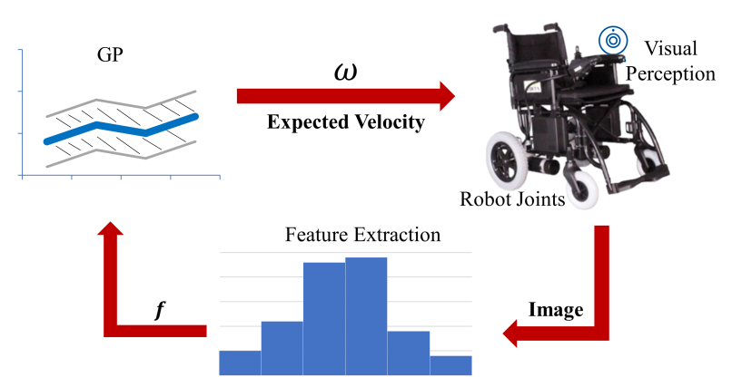

# Real-time GP-based Wheelchair Corridor Following



- This repo has the implementation of the "Real-time 
GP-based Wheelchair Corridor Following".
- The code in this repo can be used as a base framework for further
experiments on different datasets and different 
  descriptors to be used with GP.
- To use this repo, install all the requirements
from the "requirements.txt" file as follows:
`  pip install -r requirements.txt`
  
## Configuration
- To run a new experiments, the configuration
can be set in the "configuration.py". 

## Dataset

- In this repo, there is a dataset folder that contain 
two main datasets:
  - normal: which consists of (2610) images for corridors
    gathered from different sources.
  - noisy: which is the normal dataset where each image
    randomly noised with one of four different 
    noises which are as follows: 
    - JPEG Compression (672)
    - Motion Blur (629)
    - Mild (654)
    - Strong Gaussian (655)
    
## Descriptors 

- The available descriptors are:
  - Hog
  - Resnet18 (different layers can be used)

- "descriptor_extraction.py" is responsible for 
extracting the descriptors for the specified
  dataset

- The descriptors will be saved under the path:
"saved_files/descriptors"

- Note: new descriptor can be added by following
the descriptor interface.
  
## Train and Test
- After extracting the descriptors, you can run
the "train.py" to train and test a GP model.
  
- The trained gp model with the test results
  will be saved under the path: "saved_files/results"
  
## Citation

- If you used this repo, please cite the following 
  publication: 
```
@inproceedings{tello2021real,
  title={Real-time GP-based Wheelchair Corridor Following},
  author={Tello, Ammar and Hafez, AH Abdul and Sarakbi, Bakr},
  booktitle={2021 29th Signal Processing and Communications Applications Conference (SIU)},
  pages={1--4},
  year={2021},
  organization={IEEE}
}
```
